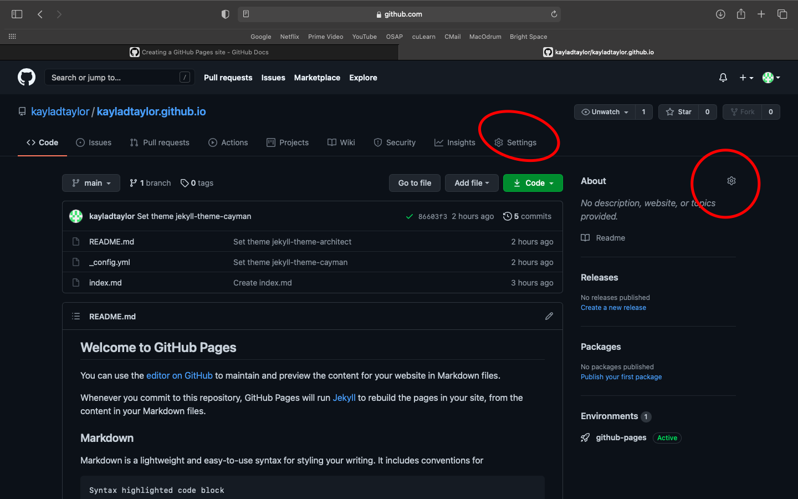
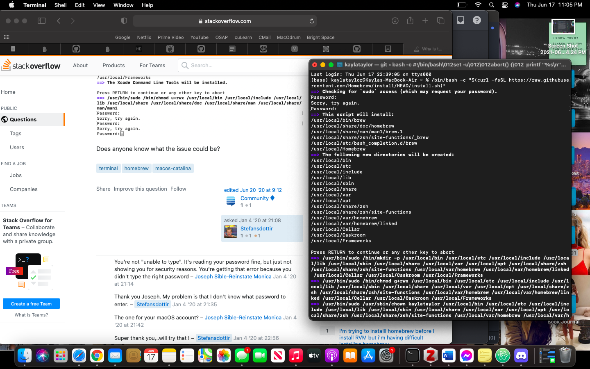
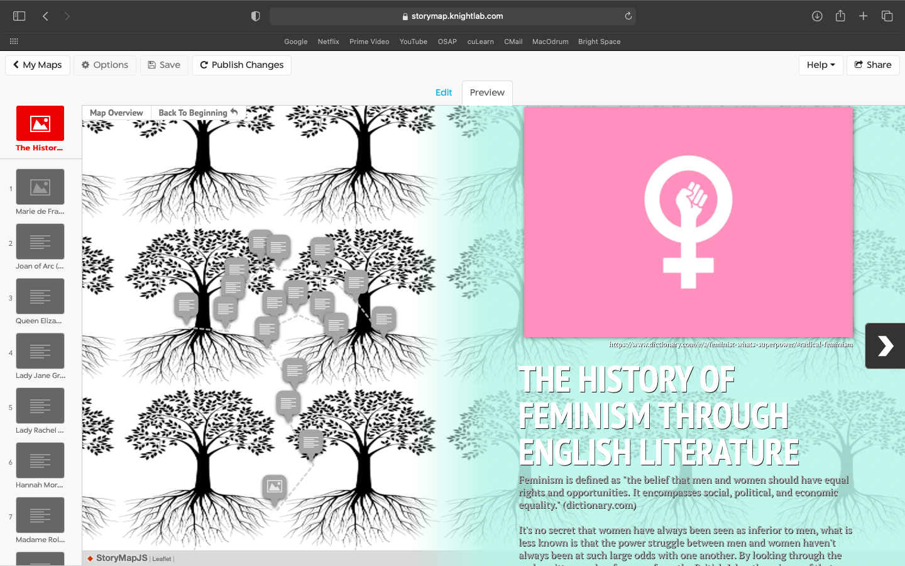
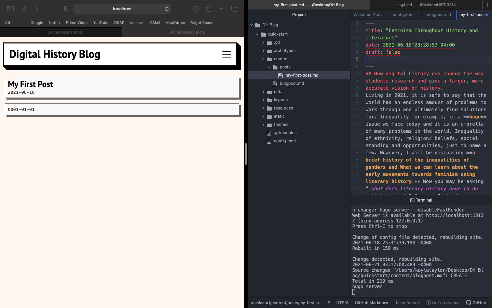

# Log: Week 4

## Getting Started
I will start this log off by saying that I had no clue what on earth I would do for this fine part. It seemed super daunting, choosing a source from some that we've read this semester and creating our own project on it. It's really intimidating to have so much creative freedom in an assignment after basically doing nothing but writing essays and reflections on sources chosen for us and sometimes the topic/ themes are already given to us as well.

With that being said, after scrolling through _Amalia Skarlatou Levi's_ twitter tread, which we first visited in the first week of this course, I remembered finding the _the Early Caribbean Digital Archive_ and the _Orlando Project_ especially interesting. I ended up choosing the _Orlando Project_ because I am currently taking an English course discussing literature and culture from 500- 1500 A.D.. Figuring that I could draw on what I learned throughout the semester to tie in with what I would learn in the _Orlando Project's_ data. Just by reading their "_scholarly introduction_" I had so many thought and ideas of what I could do for this project, you could say I was very inspired.

I really like the visual pun the _Orlando Project_ creates through viewing the history of women's writing in the British Isles as a tree. Getting the inspiration from Virginia Woolf's Biography, Orlando. The team more specifically views their work in text encoding for their project as a tree-like structure and visual pun. 1 I am choosing to use this idea of a tree to represent and document the development and growth of women's written works in the British Isles throughout history as a literal and visual representation. My hope for this is to show the progression or the history through the growth of the tree or as it branches out. I will be tying in the importance of learning women's literary history and how it can teach us about the early movements of feminism.

## My Project Plan
- **Wget:** I will *__hopefully__* be able to use Wget in order to download the data from the _Orlando Project_ database.
  - However, I am not very confident in my abilities to do so. We will see how it goes and hope I don't get flagged as an attacker or accidentally download the internet. I think think out of all the tutorials, this one scared me the most, but I definitely understand it why it is useful.
- **Cleaning & Manipulating Data with R:** I'm not sure if this step will be necessary, the _Orlando Project_ sounds like it is a very well organized database.
  - If this isn't needed I will use **Voyant** to find some sift through some data and find things more closely related to fit my research.
- **Storymaps.js:** *I'm not sure if this will work, but the idea/ plan will be to __try__ to upload my own background to storymaps.js, instead of a map I will use an image of a tree.* This will display a small number of women's written work throughout history to show the rise/ progression of feminism and how viewing these works can be beneficial in the way we have come to understand women's roles throughout history. Possibly, how our thoughts or understanding of women from the past can change. There is still a lot we as historian's and we as a society don't know about women dating back to the beginning of the English language due to their written works being lost or repressed for so long.
  - If this just completely and utterly fails me, I will use a website called _Prezi_ as my mapping tool of sorts. It's a more interactive way to do presentations, so in that case it will be the final product of my assignment.
- Lastly, to present my "final" product, I would like to _try_ the tutorial from the _standard sequence_ and create my own **static website** to display my findings as a blog post of sorts.

**Concluding note on my project plan:** I am really looking forward to pushing myself in this final part of the course. I didn't challenge myself as much as I would have liked to in the previous part.

## Failure before I've even begun

As I have noted several times throughout the first part of this log I decided to do my project using the data and findings of the _Orlando Project_ however, after taking far too long to read all the information regarding the project on their website in order to understand how to use and sort through their data: I have come to find out that you need a **subscription to be able to view and use their data!** I am already in a little too deep to change my idea, as I have started writing out the beginning of my blog post with the things I've learnt from the _Orlando Project's_ webpage. This is completely my fault and a problem I should definitely work on in the future, I am a bit of a perfectionist and I spend way too much time ensuring my arguments/ writing is, in my mind, "perfect". With only two days left before the due data, I think it's a little too late to abandon my sinking ship.

## A New Plan of Action
I really did not want to abandon this idea. I honestly think there is nothing worse in the world than getting inspiration for something, especially projects, getting excited about it, only to have to abandon it for something that may be easier to work with/ research or to better fit the requirements of an assignment. So I searched through _Amalia Skarlatou Levi's_ twitter thread in hopes of something that I could work with, and found her Google doc's list titled _Acknowledging archival silences, gaps, omissions._ Within I found two open sources that should help me in my research, one is from the [Digital Gallery](https://digitalgallery.bgsu.edu/exhibits/show/womensvoices) and the other is a [Collective Biographies of Women](https:/womensbios.lib.virginia.edu/about). I also found the [history of Feminism](https://www-routledgehistoricalresources-com.proxy.library.carleton.ca/feminism/) through the Carleton's database. I am hoping to use Carleton's tool _racer_ in order to find some sort of data set I can use in order to complete the first part of my project plan. However, with the sources and my knowledge from my _500-1500 A.D. Lit class_ I think I will be able to accomplish at least the mapping and over all presentation part of this assignment.  

**Side note:** If I had been able to give myself more time to do this assignment, I could have asked the library to request a 30 day free trial to the _Orlando Project._ However, there is no guarantee they would have done it for me or how long it would have taken.

## TUTORIAL LOG

I decided that researching and trying to find a sort of database to use for my project was wasting too much time and energy. So I decided to take a break and move on to the more fun and exciting parts.

Starting off the tutorial process with:

### Creating a static website.

1. I decided to first try out Dr. Graham's _quick static site_ tutorial from the _standard sequence_ from week 3. I followed the steps outlined:
- On Github I created a new repository, naming it _kayladtaylor-github._
- Within I created a _index.md_ file, I copied and pasted Dr. Graham's example of what to write within:
    "_## My Quick Static Site_
    _It reads [markdown](https://www.markdownguide.org/) 
    and turns it into html._
    __"

  - I did get a little confused and struggled for a solid 5 minutes at the next part. We're asked to click the gear icon, however there are 2 gear icons. One for _settings_ and one beside the _about_, I did not notice the one beside the _settings_ for approximately 5 minutes. However, afterwards I found where I needed to go, scrolled down to pages and selected a theme. 

  2. I wanted to try something that was a little more challenging for my final product, so I decided to use _Hugo_ in oder to generate a site.
  - I started out by installing _Homebrew._ The installation page made it sound like this would be super easy- and in hindsight it actually was, however I ran into some confusion.
  - _Homebrew_ gives you an installation code to run through _terminal,_ I copied and pasted it. Then, it came up with this message:
    "Checking for `sudo` access (which may request your password)." 
     - At first I entered my computer login password and it came up as incorrect, so I looked clicked the link to _installation options._ The first thing that comes up says that the script is so that you don't need to use sudo and further down the line said sudo is bad. So I for the life of me could not understand why I was being asked for _sudo_ access. I looked through the _discord channel_ and didn't find anything, I didn't want to reach out since it is currently 1:03 AM and I want to be able to find a solution more quickly. So, I took to _google!_ The first thing to come up was a person asking the [same question](https://stackoverflow.com/questions/59594875/why-is-the-terminal-prompt-asking-for-a-password-when-i-try-to-install-homebrew) I had in public form called "_stack overflow._" A person answered saying it required the password for the macOS account. It worked!

- The download process took awhile!
- Now that _Homebrew_ is installed I am entering the code: "_brew install hugo_" then "_hugo version_" in order to verify that it installed for which it "replied": _hugo v0.83.1+extended darwin/amd64 BuildDate=unknown_ which I am hoping means everything is good.
- Next I entered "_hugo new site quickstart_" into my terminal. Everything worked, my static site has been created!

    - **Side Track:** I did not see at the top of the page for downloading _hugo,_ that it says you'll also need to download _git._
    - On the _git_ website, using the install option for _Homebrew,_ I copied "_brew install git_" into terminal and everything looks good.

- **Adding a theme:**
- I chose the theme "Origin" from the list of templates hugo provides
    - I decided to follow the installation tutorial for the [origin-hugo-theme](https://github.com/moody-person/origin-hugo-theme)
- I created a new site "myblog" since this is what I will use to present my final project. In terminal I entered the code "_hugo new site myblog_" followed by:

            cd myblog
            git init
            git submodule add https://gitlab.com/asleeppiano/origin-hugo-theme.git themes/origin
- I then entered the code:
            echo theme = \"origin\" >> config.toml
- Adding content using code:
      hugo new posts/my-first-post.md
    To edit the "post" I entered:
            title: "My First Post"
            date: 2021-06-17
            draft: true
    - When entering the code, terminal "replied" _command not found,_ however when I checked out my new site it had worked, so I don't think I need to worry about that!
     - Side note for future reference: entering _draft: true_ makes it so that anything you post isn't automatically uploaded, once ready enter _draft: false_
- Next step: starting the Hugo server by entering the code:
              hugo server -D
- So, this next part is where I ran into some issues. In "customizing the theme/ site configuration" the tutorial says to open a "_config.toml_" in a text editor, I used atom. It then gives an example of what to type in:
                baseURL = "https://example.org/"
                languageCode = "en-us"
                title = "My New Hugo Site"
                theme = "origin"
But to replace the title with what you want your blog to be called. However, I tried saving the file to multiple different areas of my computer and nothing worked, I wasn't able to make any adjustments to my blog.

So, I took to the internet and started googling away at how to fix this issue and nothing seemed like it would fix my problem. I decided to head back to _Hugo_ to see if I missed anything and search the website for something that could answer and fix my problem. I found [video tutorials](https://www.youtube.com/watch?v=qtIqKaDlqXo&list=PLLAZ4kZ9dFpOnyRlyS-liKL5ReHDcj4G3&index=1)!
  - This guy has a terminal open in his _atom_ app in oder to save everything to one file. Naturally, after not finding a package for terminal on atom, I took to the internet **again.** I found out that we can download packages, (something to explore more of in the future) I opened _atom,_ went to _preferences,_ and down to _packages._ I searched _terminal_ and downloaded the third "package" on my screen called "_terminal tab._"
  - I decided to try to follow his tutorials, it wasn't super different from the tutorial on _Hugo._ However this didn't work for me either. After I downloaded and put the theme I wanted within the theme folder, I entered "_hugo server_" into the terminal in atom and it came up with an error message and told me to either try: "create a new site" or "hugo help."
    - In a shameful fit of frustration I exited atom and deleted all the files. After a taking a half hour break I decided to try something else.
  - I decided to try the original "_hugo new site quickstart_" tutorial but in my atom terminal (exactly as I did above). **And thank everything in the world that there is to thank- IT FINALLY WORKED!**
  - I was able to edit the _config.toml_ file to change the name of my blog and the terminal at the bottom of atom updated it on its own, I opened up my site and my changes were made!

### Storymaps.js

Another day, and another thing not going my way. As stating above, I was hoping to use story maps to insert a photo of a tree, instead of a map. I would then use the tree as a sort of timeline to show the progression of feminism through some of the more well known/ important written works of women (and some men) in the British Isles. Through studying literature from 500-1500 A.D. this semester I've learnt that women weren't always put so far beneath men. Women, more notably the powerful and rich held some amount of respect and also had various rights. Although fiction can't fully be taken at face value or as truth, stories and written works from these times were often a reflection of the time or what they thought to be true.

- Going on to storymaps, I tried to upload my own photo as the background of the map, no matter the size of photo I used the site would upload it as tiles instead of just one photo:

- I also couldn't use any photos unless they had direct links, making it very difficult to find an image.

- This was less than ideal and very frustrating. So, I moved on to plan B, using prezi. However, that was also a no go. Prizi only uses pre-made backgrounds from their site, and I swear in the past they have had a presentation that was a tree. But they no longer do. My next thought was to use a powerpoint, the background would be a tree and I would do something similar to what storymaps offered, but with my lack of research/ data, I now had slim picking for what tutorials from class I could use in this project.

- So back to storymaps. Despite the photo coming up tiles rather than one image, I think I can make it work and give a sample of what I wanted to do for this assignment.
- I decided just to plot the names of a sample of English writers, without the data for the Orlando project it made it very difficult to map. It would take days, if not longer, to accurately find the sources I need.

- Mapping out the names on my tree gives an idea what my project could have looked like if I had more time.

- Unfortunately, the points I plotted on the map did not stay where I placed them, the image stretched, so they are no longer on the tree. So virtually nothing went right during this project. 

- [storymaps](https://uploads.knightlab.com/storymapjs/235cad8d362fa17c590e91ad02d4c71f/the-growth-of-feminism/index.html)

- However, I will celebrate one win during this assignment: I finally got the images to work on github again!

- **Last but not least:** I could not get my blog post to upload. I searched the hugo website, I googles, I watched the youtube videos. Nothing worked. 
